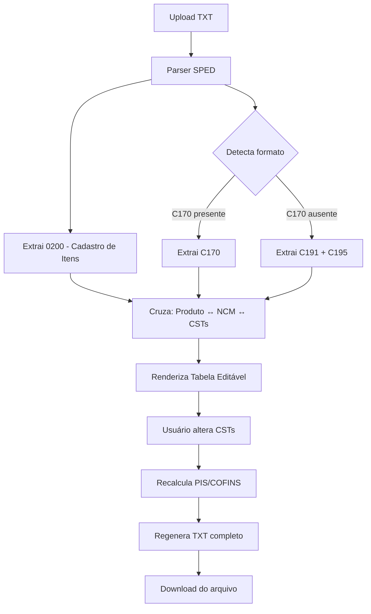

# 🏗️ Arquitetura (Preliminar) — Automação SPED PIS/COFINS

> [!NOTE]
> Documento preliminar. A arquitetura definitiva será definida após o Ryan detalhar a abordagem técnica desejada.

## Stack Proposta (sugestão inicial)

| Camada | Tecnologia | Justificativa |
|--------|-----------|---------------|
| **Frontend** | HTML + CSS + JavaScript (Vanilla ou framework leve) | Interface simples, foco na tabela de dados |
| **Lógica de Negócio** | JavaScript/TypeScript | Parser SPED, regras de CST, recálculo de valores |
| **Processamento** | Client-side (no browser) | Dados fiscais sensíveis — sem enviar para servidores |
| **Persistência** | Nenhuma (file-based) | MVP: abre arquivo → edita → exporta |

> [!IMPORTANT]
> A decisão de stack será tomada junto com o Ryan. A tabela acima é uma sugestão com base nos requisitos da reunião.

---

## Fluxo Geral da Aplicação



---

## Estrutura do Arquivo SPED (Referência)

O SPED EFD-Contribuições é um TXT com registros delimitados por pipe `|`.

```
|0000|versão|tipo|...dados da empresa...|
|0200|código|descrição|NCM|...|
|C170|...|CST_PIS|BASE_PIS|ALIQ_PIS|VL_PIS|CST_COFINS|BASE_COFINS|ALIQ_COFINS|VL_COFINS|...|
|C191|...|CST_PIS|BASE_PIS|ALIQ_PIS|VL_PIS|...|
|C195|...|CST_COFINS|BASE_COFINS|ALIQ_COFINS|VL_COFINS|...|
```

### Campos-Chave por Registro

#### 0200 — Cadastro de Itens
| Posição | Campo | Uso |
|---------|-------|-----|
| 2 | Código do Produto | Chave de ligação |
| 3 | Descrição | Exibição |
| 7 | NCM | Classificação fiscal |

#### C170 — Itens do Documento
| Campo | Uso |
|-------|-----|
| Código do Produto | Ligação com 0200 |
| CST PIS | ⚡ Campo editável |
| Base de Cálculo PIS | Recalculado |
| Alíquota PIS | 1,65% (Lucro Real) |
| Valor PIS | Recalculado |
| CST COFINS | ⚡ Campo editável |
| Base de Cálculo COFINS | Recalculado |
| Alíquota COFINS | 7,6% (Lucro Real) |
| Valor COFINS | Recalculado |

> [!WARNING]
> As posições exatas dos campos dependem da versão do layout do SPED. Será necessário consultar a documentação oficial da Receita Federal para o mapeamento correto.

---

## Módulos Propostos

```
src/
├── parser/
│   ├── sped-reader.js       # Lê e parseia o TXT do SPED
│   └── sped-writer.js       # Regenera o TXT com alterações
├── models/
│   ├── produto.js            # Modelo do item (0200)
│   └── escrituracao.js       # Modelo da escrituração (C170/C191/C195)
├── rules/
│   └── pis-cofins.js         # Regras de cálculo PIS/COFINS
├── ui/
│   ├── upload.js             # Componente de upload
│   ├── tabela.js             # Tabela editável
│   └── export.js             # Exportação do TXT
└── utils/
    └── formatters.js          # Formatação de NCM, CSTs (zeros à esquerda)
```

---

## Padrões e Princípios

- **Separação de responsabilidades**: Parser, Regras de Negócio, e UI são módulos independentes
- **Campos como strings**: Nunca converter NCM, CSTs, ou códigos para números
- **Round-trip fidelity**: O arquivo exportado deve ser idêntico ao original (exceto campos alterados)
- **Sem dependências externas** (MVP): Nenhuma chamada de API, tudo local
