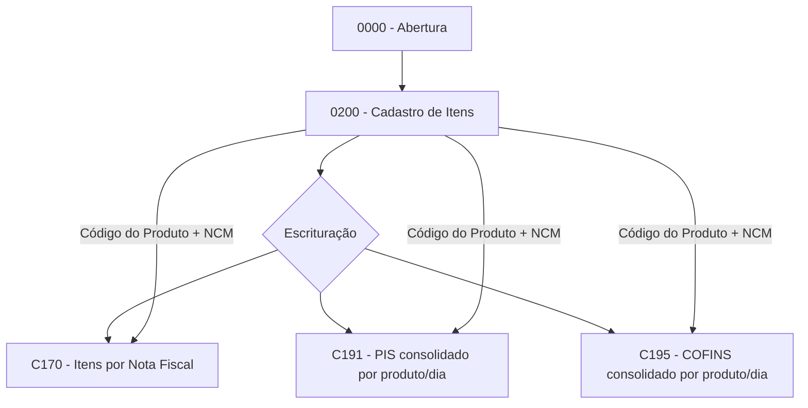
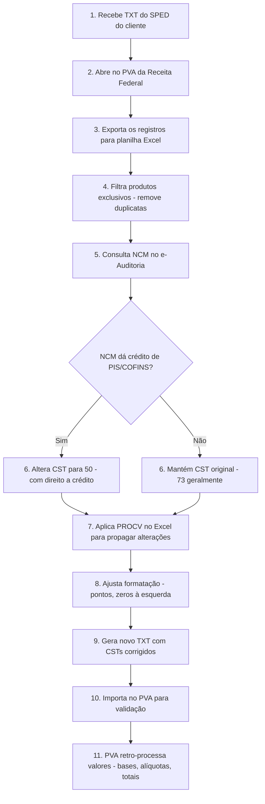

# 📋 Briefing do Kickoff — Automação SPED PIS/COFINS

> **Projeto:** Automação da Revisão de CST PIS/COFINS no SPED
> **Data da Reunião:** Fevereiro/2026
> **Stakeholder:** Wendell (Consultor Fiscal)
> **Responsável Técnico:** Ryan
> **Objetivo Macro:** Recuperação de créditos tributários de PIS e COFINS

---

## 1. Contexto do Negócio

O stakeholder (Wendell) realiza um trabalho de **revisão fiscal** para clientes, onde ele identifica oportunidades de **crédito de PIS e COFINS** que não foram aproveitadas corretamente na escrituração fiscal.

O problema central: os **sistemas ERP** dos clientes, ao darem entrada em uma nota fiscal, **não parametrizam corretamente** os CSTs (Código de Situação Tributária) de PIS e COFINS. Ou seja, o sistema gera CSTs que **não tomam crédito**, quando na realidade o produto **tem direto a crédito**.

Isso resulta em **perda financeira** para o cliente, que deixa de recuperar valores que a legislação permite.

---

## 2. O Que é o SPED PIS/COFINS (EFD-Contribuições)

O **SPED** (Sistema Público de Escrituração Digital) gera um arquivo TXT estruturado que é submetido à Receita Federal via **PVA** (Programa Validador e Assinador). Este arquivo contém **blocos** e **registros** que descrevem toda a movimentação fiscal de uma empresa em um determinado período.

### Blocos Relevantes para o Projeto

| Registro | Descrição | Dados Principais |
|----------|-----------|------------------|
| **0000** | Abertura do arquivo | Versão do layout, dados da empresa, período |
| **0200** | Cadastro de Itens | Código do produto, descrição, NCM, unidade de medida |
| **C170** | Itens do Documento (por nota fiscal) | CST PIS, CST COFINS, base de cálculo, alíquota, valor |
| **C191** | Detalhamento da Contribuição PIS (consolidado por produto/dia) | CST PIS, base de cálculo PIS, alíquota (1,65%), valor PIS |
| **C195** | Detalhamento da Contribuição COFINS (consolidado por produto/dia) | CST COFINS, base de cálculo COFINS, alíquota (7,6%), valor COFINS |

### Relação entre Registros



> [!IMPORTANT]
> O arquivo pode ter a escrituração **no C170** (por nota fiscal) OU **nos C191/C195** (consolidado por produto/dia). **Nunca ambos** para o mesmo item. O sistema precisa tratar ambos os cenários.

---

## 3. Fluxo Atual (Manual) do Wendell



### Problemas do Fluxo Manual

| Problema | Impacto |
|----------|---------|
| PROCV manual entre planilhas | Lento, sujeito a erros |
| Formatação com pontos no NCM | e-Auditoria usa pontos, SPED não usa — precisa converter |
| Zeros à esquerda perdidos | Excel remove zeros à esquerda do NCM ao converter |
| Processo repetitivo por cliente | Cada cliente é um ciclo completo do zero |
| Consulta NCM um a um | No fluxo manual, cada NCM é consultado individualmente |

---

## 4. O Que o Wendell Deseja (Visão do Produto)

### Fluxo Desejado


### Resultado Esperado (nas palavras do stakeholder)

> "Como se eu jogasse meu arquivo TXT, importasse, visualizasse os dados, alterasse os CSTs, e exportasse de volta em TXT para colocar no PVA."

### Especificação Funcional (saída da reunião)

| Funcionalidade | Descrição |
|---------------|-----------|
| **Input** | Upload de arquivo TXT (SPED EFD-Contribuições) |
| **Processamento** | Parse dos registros 0200, C170, C191, C195 |
| **Visualização** | Tabela com: Código do Produto, Descrição, NCM, CST PIS, CST COFINS |
| **Edição** | Usuário altera CST PIS e CST COFINS manualmente por produto |
| **Output** | Exportação do TXT SPED completo com os CSTs alterados |
| **Manutenção da Estrutura** | O TXT de saída mantém TODA a estrutura do arquivo original — apenas os campos CST são alterados |

---

## 5. Regras de Negócio Identificadas

### CSTs Relevantes

| CST | Significado | Ação |
|-----|-------------|------|
| **50** | Operação com Direito a Crédito (Vinculada Exclusivamente a Receita Tributada) | ✅ Gera crédito |
| **73** | Operação de Aquisição sem Direito a Crédito | ❌ Sem crédito (mais comum nos ERPs) |
| **Entre outros** | Existem outros CSTs que geram crédito | Stakeholder define caso a caso |

### Alíquotas

| Contribuição | Alíquota Padrão (Lucro Real) |
|-------------|------------------------------|
| **PIS** | 1,65% |
| **COFINS** | 7,6% |

### Base de Cálculo

```
Base de Cálculo = Valor do Item - Desconto
Valor PIS = Base de Cálculo × 1,65%
Valor COFINS = Base de Cálculo × 7,6%
```

### Regime Tributário

- O processo descrito aplica-se a empresas no **Lucro Real**
- O padrão de CST e alíquotas é sempre o mesmo para **Regime Geral de Lucro Real**

### Lógica de Registros

- **C170**: escrituração por nota fiscal (detalhamento item a item)
- **C191**: PIS consolidado por produto/dia
- **C195**: COFINS consolidado por produto/dia
- O arquivo gera **ou** C170 **ou** C191+C195 — **nunca os dois**
- Na prática, a maioria dos arquivos usa **C170**
- Quando não há C170, o sistema deve buscar nos **C191 e C195**

### Fonte de Verdade para Crédito

- A consulta de **se um NCM dá direito a crédito** é feita no sistema **e-Auditoria** (ferramenta online de auditoria fiscal)
- No futuro, essa base pode ser internalizada no sistema

---

## 6. Glossário de Termos Corrigidos

A transcrição automática gerou diversos termos incorretos. Abaixo a tabela de correção:

| Transcrição Incorreta | Termo Correto | Descrição |
|----------------------|---------------|-----------|
| PVPVA / BVA / PVE / IPVA | **PVA** | Programa Validador e Assinador da Receita Federal |
| pisorfins / piso porins / POFEMS / pisicofins / pisfesa | **PIS/COFINS** | Contribuições federais |
| golpe / Golfins | **Bloco** (do SPED) / **COFINS** | Blocos da escrituração / Contribuição |
| pro que fez / prock V / proque | **PROCV** | Função de consulta do Excel (VLOOKUP) |
| ICM / ICMS | **NCM** (na maioria dos contextos) | Nomenclatura Comum do Mercosul |
| ser um / C de hora / ser1 / 670 | **C191** / **C170** | Registros do SPED |
| maisador / barador | **Validador** | PVA — Programa Validador |
| grosente | **PROCV** (contexto de fórmula Excel) | Referência à planilha Excel |
| e-Auditoria / auditoria | **e-Auditoria** | Sistema online de regras fiscais por NCM |
| TT / TXT | **TXT** | Formato do arquivo SPED |
| Marcelo | **Marcelo** | Referência a colega que sugeriu o sistema |
| eupedepede | **EFD PIS/COFINS** (EFD-Contribuições) | Escrituração Fiscal Digital |
| alíota / aliíquota | **Alíquota** | Percentual de tributação |
| retrocesso / retrocessar / retro-processa | **Retroprocessar** | PVA recalcula valores ao importar alterações |

---

## 7. Stakeholders

| Pessoa | Papel | Responsabilidade |
|--------|-------|------------------|
| **Wendell** | Consultor Fiscal (Stakeholder Principal) | Define regras de negócio, valida resultados, usuário final |
| **Marcelo** | Coordenador/Supervisor | Idealizou a solução, define prioridades |
| **Ryan** | Desenvolvedor Técnico | Arquiteta e implementa o sistema |

---

## 8. Riscos Iniciais

| Risco | Impacto | Probabilidade | Mitigação |
|-------|---------|---------------|-----------|
| Estrutura do TXT variar entre clientes | Alto | Média | Validar com múltiplos arquivos de teste |
| Perda de zeros à esquerda em NCMs | Médio | Alta | Tratar todos os campos como string, nunca como número |
| CSTs incorretos gerarem autuação fiscal | Crítico | Baixa | Validação humana obrigatória antes do export |
| e-Auditoria mudar de formato | Médio | Baixa | Abstrair fonte de regras fiscais |
| PVA rejeitar o TXT gerado | Alto | Média | Testes exaustivos com o validador do PVA |

---

## 9. Dependências Externas

| Dependência | Tipo | Status |
|------------|------|--------|
| Arquivo TXT de exemplo (SPED real) | Amostra de dados | ⏳ Pendente — solicitar ao Wendell |
| Acesso ao e-Auditoria | Referência de regras fiscais | ✅ Disponível online |
| PVA da Receita Federal | Validação do output | ✅ Disponível para download |
| Planilhas Excel do Wendell (fluxo manual) | Base de conhecimento | ⏳ Solicitar ao Wendell |

---

## 10. Métrica de Sucesso

| Métrica | Meta |
|---------|------|
| Tempo de processamento de 1 arquivo | < 5 minutos (vs. horas no manual) |
| Taxa de rejeição pelo PVA | 0% (arquivo deve ser aceito sem erros) |
| Cobertura de registros | 100% dos registros C170 ou C191+C195 processados |
| Fidelidade do TXT de saída | Estrutura idêntica ao original, exceto campos CST alterados |

---

## 11. Próximos Passos

1. ⏳ **Receber arquivo TXT de exemplo** do Wendell
2. ⏳ **Receber planilhas Excel** do fluxo manual do Wendell  
3. 🔜 **Aguardar explicação detalhada** do Ryan sobre como construir o sistema
4. 📐 **Definir arquitetura técnica** com base nos requisitos
5. 🛠️ **Implementar MVP** (Fase 1 do Roadmap)
